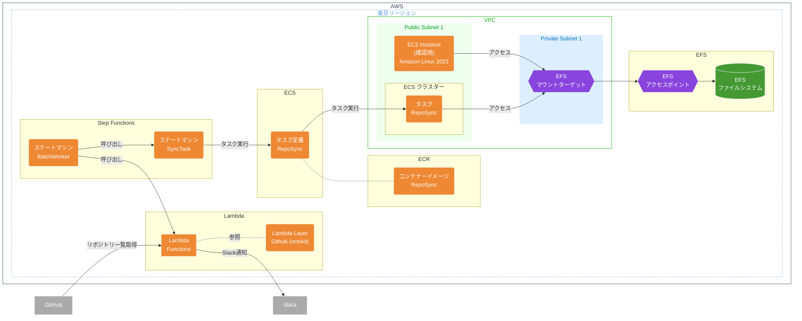

# GitHub バックアップ

## サービス構成




## AWS ログイン設定

SSO でログインする場合は `~/.aws/config` にプロファイルを追加する。
※ `sso_account_id` は AWS アカウント ID を指定

```
[profile github-backup-prod]
sso_start_url = https://mseninc.awsapps.com/start#
sso_region = ap-northeast-1
sso_account_id = ************
sso_role_name = PowerUserAccess
region = ap-northeast-1
output = json
sso_session = mseninc
```

※ただし、 PowerUserAccess 権限では IAM ポリシーの Detach ができず、スタックの削除はできない可能性があるため、その場合は AdministratorAccess 権限を使用する。

## スタック一覧

| ファイル名            | 説明                                        |
| --------------------- | ------------------------------------------- |
| 01_base.yml           | EC2 用キーペア, EFS ファイルシステム        |
| 02_infra.yml          | VPC, ネットワーク周り, EFS 周り             |
| 03_ec2.yml            | EFS ファイルシステム確認用 EC2 インスタンス |
| 04_lambda-layers.yml  | Lambda レイヤー                             |
| 05_ecr-images.yml     | ECR へのコンテナーイメージのプッシュ        |
| 06_ecs-cluster.yml    | ECS クラスター, リポジトリ同期タスク定義    |
| 07_step-functions.yml | Step Functions ステートマシン定義           |

### ステートマシン一覧

| ステートマシン名 | 説明                                                          |
| ---------------- | ------------------------------------------------------------- |
| BatchWorker      | GitHub の全リポジトリのバックアップを実行するステートマシン   |
| SyncTask         | GitHub の単一リポジトリのバックアップを取得するステートマシン |

`BatchWorker` は EventBridge で毎週日曜日 午前5時に呼び出されます。

`SyncTask` は `BatchWorker` から呼び出されます。 `SyncTask` は単体でも動作します。単体で実行する場合は `{ "owner": "msen", "repo": "aws-github-backup" }` のように JSON を入力してください。

## デプロイ方法

### インストール

ローカル環境に Serverless Framework をインストールする。

```
cd aws-github-backup
npm install
```

### 準備

### CloudWatch Logs の Resource based policy 更新

- [cloudwatch-logs-resource-policy.md](cloudwatch-logs-resource-policy.md) を参照して、 `cloudwatch-logs-resource-policy.json` を編集して、 CloudWatch Logs の Resource based policy を更新する。

#### SSM パラメーターの設定

以下のパラメーターを SSM パラメーターストアに設定する。

| パラメーター名    | 説明                                                                                                                       |
| ----------------- | -------------------------------------------------------------------------------------------------------------------------- |
| github-token      | GitHub トークン                                                                                                            |
| slack-webhook-url | Slack Webhook URL ([Incoming Webhook](https://mseninc.slack.com/apps/A0F7XDUAZ--incoming-webhook-?tab=settings&next_id=0)) |

```
aws ssm put-parameter --name github-token --value <GITHUB TOKEN> --type SecureString
aws ssm put-parameter --name slack-webhook-url --value <GITHUB USERNAME> --type SecureString
```

### スタックのデプロイ

基本的には番号付きのスタックを順番にデプロイする。

```
npx serverless deploy --stage prod --config 01_base.yml
npx serverless deploy --stage prod --config 02_infra.yml
npx serverless deploy --stage prod --config 03_ec2.yml
npx serverless deploy --stage prod --config 04_lambda-layers.yml
npx serverless deploy --stage prod --config 05_ecr-images.yml
npx serverless deploy --stage prod --config 06_ecs-cluster.yml
npx serverless deploy --stage prod --config 07_step-functions.yml
```

## 確認用インスタンスの起動・接続

EC2 インスタンス `github-backup-ec2-instance` を開始する。

- [インスタンス | EC2 | ap-northeast-1](https://ap-northeast-1.console.aws.amazon.com/ec2/home?region=ap-northeast-1#Instances:v=3;$case=tags:true%5C,client:false;$regex=tags:false%5C,client:false)

EC2 コンソールでインスタンスを右クリックして「接続」をクリック→「セッションマネージャー」を選んで接続する。

sh で接続されるので、 bash を起動する。

```
sh-4.2$ bash
[ssm-user@ip-172-30-7-113 bin]$
```

`/mnt/efs` に EFS がマウントされていなければ、 `mount -a` を実行する。

```
[ssm-user@ip-172-30-7-113 bin]$ ll /mnt/efs
total 0
[ssm-user@ip-172-30-7-113 bin]$ mount -a
```

```
[ssm-user@ip-172-30-7-113 bin]$ ll /mnt/efs | more
total 704
drwxr-xr-x  3 ec2-user ec2-user 6144 Apr 26 07:55 Information-asset-management
drwxr-xr-x  3 ec2-user ec2-user 6144 Apr 26 07:54 Visitor-Record
drwxr-xr-x  7 ec2-user ec2-user 6144 Apr 26 08:08 a11-06-chinese-phonological-search
```

インスタンスが不要になったら、インスタンスを停止する。
